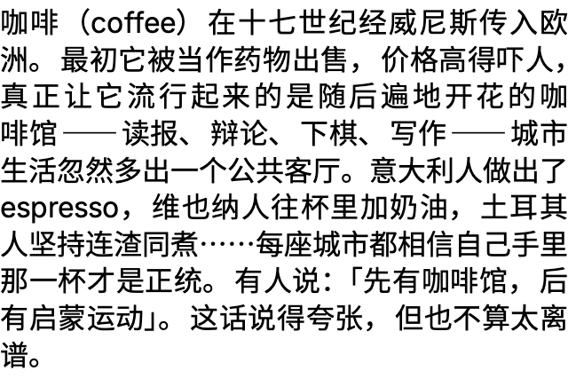
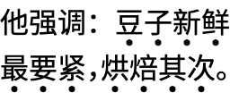
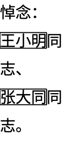

# 提椠 Tíqiàn

提椠是一个面向中文正文的 CJK 段落排版引擎，目标是 [CLREQ](https://w3c.github.io/clreq/)
横排核心需求：字体 fallback、标点空间、避头尾、两端对齐、着重号与示亡号——
并且每一个排版决策都可以被 dump 出来解释。



上图为引擎实际渲染（320px 版心、两端对齐）：全角括号与拉丁词混排、
破折号占两字宽且不可拆分、`「」` 引号与相邻标点挤压、行尾标点自然半宽、
中西文边界自动间距。

| 着重号 | 示亡号 |
|---|---|
|  |  |

## 特点

- **决策可解释**：每个 cluster 的字体选择、每个标点的 ink/body/glue、
  每个断点的候选与修复方案、每行的对齐分配都有结构化记录与 golden 基线。
- **度量来自字体**：标点半宽 body 取 OpenType `halt`，中文破折号取 `locl`
  变体，AWT / Skia / Android 三平台 shaping 交叉验证。
- **真实 pipeline**：`text → fallback → shaping → metrics → punctuation
  atom → glue → line layout → render`，前端（Compose Desktop 已接）只负责
  绘制，不做任何排版决策。

## 模块

| 模块 | 职责 |
|---|---|
| `tiqian-core` | 平台无关数据模型（cluster、glyph run、line box、layout result） |
| `tiqian-font` | 字体 fallback、角色分类、排版度量策略 |
| `tiqian-shaping-api` / `-jvm` / `-skia` / `-android` | shaping 抽象与 AWT / Skiko / TextPaint 平台 adapter |
| `tiqian-linebreak` | 断行机会接口 |
| `tiqian-clreq` | CLREQ profile、标点分类与策略表 |
| `tiqian-layout` | 标点 atom/glue、断行与避头尾修复、两端对齐、段落引擎 |
| `tiqian-compose` / `tiqian-android-view` | 前端（Compose Desktop 渲染已接；Android View 为 contract） |
| `tiqian-playground` / `tiqian-test` | 调试可视化与 fixture |

## 上手

```shell
./gradlew build                              # 编译 + 全部测试
./gradlew :tiqian-playground:runPlayground   # 生成 layout dump + HTML 调试报告
./gradlew :tiqian-compose:runComposeDemo     # Compose Desktop 渲染窗口
```

Playground 报告输出在
`tiqian-playground/build/reports/tiqian-layout-playground/index.html`，
默认使用 `jvm-awt` shaper，`TIQIAN_PLAYGROUND_SHAPER=skia|stub` 可切换。

## 文档

- [docs/roadmap.md](docs/roadmap.md) — Slice/Milestone 状态与「当前位置」。
- [docs/adr/](docs/adr/) — 已确定的取舍。
- [docs/cjk-layout-engine-design.md](docs/cjk-layout-engine-design.md) — 核心模型设计（讲「为什么」）。
- [docs/contributing.md](docs/contributing.md) — 实现约束、流程与提交格式。
